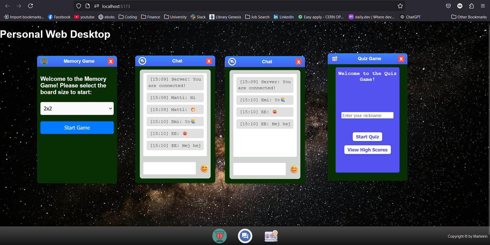

# A3 SPA

The application is an SPA that acts as a **Personal Web Desktop** with 3 applications that can be opened by clicking on the icons on the bottom footer. Each app can be opened and interacted with separately. The apps provided include a memory game, a web socket chat application and a quiz game. Below is an example screenshot of the PWD at runtime with several application windows open.

# Short video presentation of the app with code highlights
<a>https://youtu.be/vmkvgITyJvA</a>

# Example Screenshot

# Memory Game
- The user can open and play multiple memory games simultanously
- The user can play the memory game using only the keyboard
- Extended feature: The gameboard is resizable and has a timer for each instance as well as counting the number of attempts per instance for the user to engage with it in a competative way!

# Chat App
- Extended features: Change username between instances in the same PWD and time stamp for each message!
- emoji support has been implemented
- Added support for code, works also for inline code in a single message with regular text!
- Added the ability to select channel to communicate in or to listen to all channels

# Quiz Game

 The Quiz game works the same as for the second Assignment! The SPA supports opening multiple instances of the quiz game and playing it simultanously on each instance. 

- When quiz game is restarted, it is not the PWD that is reloaded but rather the DOM's state

# Overall extra features
- Minimize Apps
- Maintain the open apps in a taskbar so they are hidden from view but maintain their state.

# How to install and run the app
1. Clone the repo with <code> git clone git@gitlab.lnu.se:1dv528/student/mh226eh/a3-spa.git </code>
2. run the app with <code> npm run server</code> or <code>npm run dev</code>
3. Type **o** in the console to open the app in the browser!

# Code structure
*There is only one html file called index.html that is the start of the application*

*As for the styling I have several css files seperated by concerns of major components and then all importat and called from the style.css to centralize the styling logic.*

<h3> Modules </h3>
The javascript code is organized into ES modules and classes. The website starts from the main.js that calls the window applications upon button clicks. The modules are organised as follows:

- **chat.js**: Which is a class to instantiate a new chat object for each chat window and seperate each instance. It relies on the <code> websocket.js</code> and <code> emoji-button</code> node module.
- **memoryGame.js**: This modules handles the DOM manipulation, events and game logic required for the game.
- **quizGame**: The quiz game is based on assignment 2, but had to be majorly refactored to function in the SAP. It is organized by the <code>quizGame.js</code> is the entry points and controls the flow of the quiz. The the <code>game.js</code> controls quiz logic, using other modules like <code>fetch.js</code> and <code>UIHelpter.js</code> to fetch and post to the server, and manipulating the DOM effectively.

The screenshot below shows the overall directory structure for the source code:

